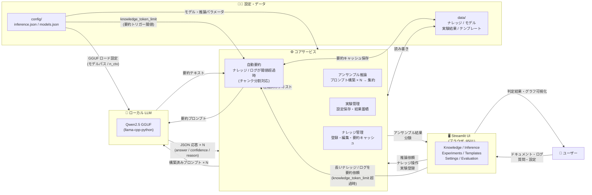
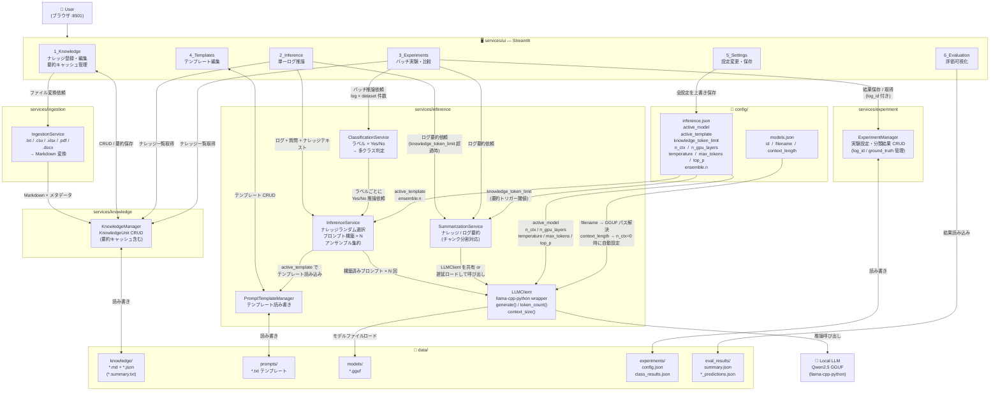

# Prompt Ensemble Reasoning System

Prompt Ensemble Reasoning System は、
**ドキュメントナレッジを利用した LLM アンサンブル推論実験環境**です。

ローカル AI の出力不安定性をカバーするため、
**同一の質問に対して複数のプロンプトバリエーションを生成し、複数回推論を行ってアンサンブルにより最終判断を下す**アプローチを採用しています。

主な目的は以下です。

* ドキュメントから **ナレッジユニットを作成**
* ログ（テキスト）を入力として **LLM で推論**
* **Yes / No 判定 + confidence + reason** を取得
* **複数プロンプト × 複数推論の結果をアンサンブル**して信頼性を向上
* **実験条件（プロンプト・モデル・設定）を比較・再現**

Streamlit UI を通じて **すべての設定を GUI から操作可能**です。

---

# Quick Start

前提条件: **Docker + Docker Compose**

## 1. モデルをダウンロード

```bash
# 利用可能なモデル一覧を確認
docker compose run --rm downloader --list

# モデルをダウンロードしてアクティブに設定（例: 3B 軽量版）
docker compose run --rm downloader --model-id qwen2.5-3b-instruct-q4_k_m --set-active
```

## 2. UI を起動

```bash
docker compose up ui
```

ブラウザで http://localhost:8501 を開いてください。

## 3. ナレッジを登録

**Knowledge** ページからファイルをアップロード（.txt / .csv / .xlsx / .pdf / .docx）または手動入力します。

## 4. 推論を実行

**Inference** ページでログテキストと質問を入力して「推論実行」ボタンを押します。

---

# テスト

各サービスは独立した Docker コンテナでユニットテストが実行できます。LLM モデルは不要です。

## ユニットテスト（LLM 不要）

```bash
docker compose run --rm knowledge    # KnowledgeManager テスト
docker compose run --rm inference    # InferenceService テスト（LLM はモック）
docker compose run --rm experiment   # ExperimentManager テスト
docker compose run --rm ingestion    # IngestionService テスト
```

## 統合テスト（GGUF モデルが必要）

事前に `downloader` でモデルをダウンロードしておくこと。

```bash
docker compose run --rm inference pytest -m integration -v
```

---

# サンプルデータによる動作確認

`data/knowledge/` に設備トラブル分類用のサンプルナレッジが 5 件含まれています。

| ナレッジ ID | 内容 |
|------------|------|
| `electrical_trouble_signs` | 電気系障害の兆候・症状パターン |
| `software_trouble_signs` | ソフトウェア系障害の兆候・症状パターン |
| `mechanical_trouble_signs` | 機械系障害の兆候・症状パターン |
| `error_code_E01` | エラーコード E01 の説明と対処 |
| `error_code_E10` | エラーコード E10 の説明と対処 |

## 試してみるサンプルログ

以下のログを **Inference ページ**のログ入力欄に貼り付けてお試しください。

**ログ例 1（電気系）**

```
[ERROR] モーター駆動回路で過電流を検知（計測値: 15.3A、許容値: 10A）
E01 コードが 3 回連続発生。ブレーカーが自動遮断。
直前に制御盤内の温度上昇を確認（42°C → 78°C）。
```

**ログ例 2（ソフト系）**

```
[WARN] コントローラー応答タイムアウト (30s)
ファームウェアバージョン不一致を検出（本体: v2.1.0、サーバー要求: v2.3.0）
通信バッファオーバーフロー、再起動後も再発。
```

**ログ例 3（機械系）**

```
[WARN] 振動センサー異常値検知（0.9G、閾値: 0.5G）
軸受け温度上昇（65°C）、E10 コード発生。
前回メンテナンスから 8,000 時間経過。
```

## 多クラス分類の手順

「電気系 / ソフト系 / 機械系」のどれかを判定するには、**同じログに対して 3 つの質問を個別に実行**して confidence を比較します。

| 質問 | ログ例 1 の期待結果 |
|------|---------------------|
| これは電気系の障害ですか？ | yes（confidence 高） |
| これはソフトウェア系の障害ですか？ | no |
| これは機械系の障害ですか？ | no |

confidence が最も高いカテゴリが推定結果です。

## 実験比較の手順

同じ質問に対してプロンプトやパラメータを変えた場合の精度差を可視化できます。

1. **Experiments ページ → 作成タブ** で 2 つの実験を作成
   - `exp_default`: テンプレート `default`、temperature `0.7`
   - `exp_cot`: テンプレート `chain_of_thought`、temperature `0.7`
2. **推論実行タブ** で各実験に同じログ × 同じ質問を投入
3. **比較タブ** で answer / confidence / yes_ratio を横並びで比較

## 結果の読み方

| フィールド | 意味 |
|-----------|------|
| `answer` | 最終判定（yes / no） |
| `confidence` | 重み付き信頼度（0.0〜1.0）。1.0 に近いほど確信度が高い |
| `yes_ratio` | N 回の推論のうち yes と答えた割合。0.5 前後は判定が不安定 |
| `reason` | 信頼度が最も高かった推論の根拠テキスト |

`yes_ratio` が 0.4〜0.6 の場合は判定が揺れているサインです。アンサンブル回数を増やすか、ナレッジを追加・修正して再試行してください。

---

# 自分のデータで使う

## ナレッジの登録方法

### UI からアップロード（推奨）

**Knowledge ページ → ファイルアップロード** から以下の形式を取り込めます。

| 形式 | 変換方法 |
|------|---------|
| `.txt` / `.md` | そのまま Markdown として登録 |
| `.csv` | Markdown テーブルに変換 |
| `.xlsx` / `.xls` | 各シートを Markdown テーブルに変換 |
| `.pdf` | テキスト抽出して登録 |
| `.docx` | 段落・テーブル抽出して登録 |

### ファイルを直接配置する方法

`data/knowledge/` に `.md` と `.json` のペアを配置すると自動的に認識されます。

**`<knowledge_id>.md`** — 本文（Markdown）:

```markdown
# タイトル

ナレッジの本文。LLM が読んで理解できる平易な文体で記述する。
具体的な数値・条件（例: 「60°C 以上」「3 回連続発生」）を含めると判定精度が上がる。
```

**`<knowledge_id>.json`** — メタデータ:

```json
{
  "knowledge_id": "<knowledge_id>",
  "title": "人間向けタイトル",
  "source": "出所（ファイル名・文書名など）",
  "summary": null,
  "embedding": null
}
```

## ログの形式

ログは**自由テキスト**です。以下の情報が含まれると推論精度が上がります。

- エラーコード・警告コード
- センサー値・計測値（単位と閾値も含める）
- 発生時刻・発生頻度・継続時間
- 直前の操作・イベント

```
[ERROR 2025-01-15 09:32] E01 過電流検知 (15.3A > 10A 許容値)
温度センサー: 78°C (正常範囲: 20-60°C)
直前に負荷変動あり (+30%)
ブレーカー自動遮断、3 回連続発生
```

## 正解ラベルの形式（評価用）

推論精度を定量評価したい場合は、以下の JSON 形式で正解ラベルを用意します。
`data/eval_labels.json` として配置することを推奨します。

```json
[
  {
    "log_id": "log_001",
    "log_text": "ログ本文をここに記述",
    "difficulty": "easy",
    "note": "過電流・E01 は電気系の典型症状",
    "labels": {
      "これは電気系の障害ですか？":           "yes",
      "これはソフトウェア系の障害ですか？":   "no",
      "これは機械系の障害ですか？":           "no"
    }
  },
  {
    "log_id": "log_002",
    "log_text": "ログ本文",
    "difficulty": "hard",
    "note": "電気系と機械系の複合障害。判定が難しい",
    "labels": {
      "これは電気系の障害ですか？":           "yes",
      "これはソフトウェア系の障害ですか？":   "no",
      "これは機械系の障害ですか？":           "yes"
    }
  }
]
```

| フィールド | 型 | 説明 |
|-----------|-----|------|
| `log_id` | string | ログの一意識別子 |
| `log_text` | string | 推論時に入力するログ本文 |
| `difficulty` | `"easy"` / `"medium"` / `"hard"` | 判定難易度 |
| `note` | string | 正解の根拠（人間向けメモ） |
| `labels` | object | 質問文字列 → `"yes"` または `"no"` |

## ナレッジ設計のコツ

| コツ | 説明 |
|------|------|
| 1 ファイル = 1 トピック | 複数の話題を混在させない。LLM がどのナレッジに基づいて答えたかを把握しやすくなる |
| 件数は 5〜20 件 | 少なすぎるとランダムサンプリングの効果が出ない |
| 具体的な数値・条件を含める | 「温度が高い」より「60°C 以上」の方が LLM が判断しやすい |
| サマリーを活用する | 長いナレッジは Knowledge ページでサマリーを登録するとトークン消費を抑えられる |

---

# 1. Ensemble Reasoning の概念

## 1.1 なぜアンサンブルか

ローカル LLM は同じプロンプトでも毎回異なる結果を返す場合があります。
本システムでは以下の手法で出力の不安定性をカバーします。

1. **ナレッジのランダム選択**: 全ナレッジの中からランダムにサブセットを選択し、毎回異なるコンテキストでプロンプトを構成
2. **複数プロンプト生成**: 同一質問に対して異なるナレッジ構成のプロンプトを N 個生成
3. **複数回推論**: N 個のプロンプトをそれぞれ LLM に投入
4. **アンサンブル集約**: 複数の `yes / no` + `confidence` をまとめ、最終的な確率・判断を出力

```
同一質問
  ↓
ナレッジランダム選択 × N
  ↓
プロンプト × N
  ↓
LLM 推論 × N
  ↓
アンサンブル集約
  ↓
最終判断（answer / confidence）
```

## 1.2 多クラス推論への拡張

Yes / No を基本としますが、**多クラス分類も複数の Yes / No クエスチョンで実現**します。

例：トラブル原因がどの系統かを判定する場合

| 質問                       | answer | confidence |
| -------------------------- | ------ | ---------- |
| このログは電気系の問題ですか？ | yes    | 0.82       |
| このログはソフト系の問題ですか？ | no   | 0.31       |
| このログはメカ系の問題ですか？ | no    | 0.22       |

→ confidence を比較し、最も確率の高いカテゴリを推定する

---

# 2. Architecture

システムは **マイクロサービス構成**です。

```
.
├── services/
│   ├── ui/                     # Streamlit UI（5ページ）
│   ├── inference/              # アンサンブル推論エンジン
│   ├── knowledge/              # ナレッジ管理
│   ├── ingestion/              # ドキュメント取り込み
│   └── experiment/             # 実験管理
├── scripts/
│   └── download_model.py       # GGUF モデルダウンローダー
├── data/
│   ├── knowledge/              # ナレッジ (.md + .json)
│   ├── experiments/            # 実験結果 (config.json + results.json)
│   ├── models/                 # GGUF モデルファイル
│   ├── prompts/                # プロンプトテンプレート (.txt)
│   └── logs/                   # 推論ログ
├── config/
│   ├── inference.json          # active_model / 推論パラメータ
│   └── models.json             # モデルレジストリ
└── tests/                      # 各サービスのユニットテスト
```

## 2.1 概要図



## 2.2 詳細構成ブロック図



## 2.3 設定の反映フロー

| 設定ファイル | キー | 反映先コンポーネント | 役割 |
|------------|------|-------------------|------|
| `inference.json` | `active_model` | `LLMClient` | ロードする GGUF モデルを選択 |
| `inference.json` | `n_ctx` | `LLMClient` | コンテキスト長（0 = `models.json` の `context_length` を自動使用） |
| `inference.json` | `n_gpu_layers` | `LLMClient` | GPU オフロード層数（0 = CPU のみ） |
| `inference.json` | `temperature / max_tokens / top_p` | `LLMClient` | 生成パラメータ |
| `inference.json` | `active_template` | `InferenceService` | プロンプトテンプレート名 |
| `inference.json` | `ensemble.n` | `InferenceService` | 1 質問あたりの推論回数 |
| `inference.json` | `knowledge_token_limit` | `SummarizationService` | 要約トリガー閾値（トークン数）。0 で無効 |
| `models.json` | `filename` | `LLMClient` | `data/models/` 内の GGUF ファイル名 |
| `models.json` | `context_length` | `LLMClient` | `n_ctx=0` 時のフォールバック値 |
| `data/prompts/*.txt` | テンプレート本文 | `InferenceService` | `{knowledge}` / `{log}` / `{question}` を埋め込むプロンプト雛形 |

---

# 3. Core Concepts

## 3.1 Knowledge Unit

本システムでは **1 ファイル = 1 ナレッジ**とします。

```
knowledge/
    contract_rule_01.md
    company_policy_03.md
    legal_rule_12.md
```

### 特徴

* カテゴリ分けなし（ランダム選択のため不要）
* markdown ベース
* LLM が理解できるよう整理されたテキスト

### Knowledge Metadata

ナレッジには JSON メタデータを付与できます。

```
contract_rule_01.json
```

```json
{
  "knowledge_id": "contract_rule_01",
  "title": "Contract Termination Rule",
  "source": "legal_document",
  "summary": "Rule describing when contract termination is allowed",
  "embedding": null
}
```

## 3.2 Knowledge Summary Cache

ナレッジは事前に要約を作成しキャッシュできます。

理由

* 推論高速化
* トークン削減

```
summary_cache/
    contract_rule_01.summary.txt
```

---

# 4. Input Specification

## 4.1 ログ入力

推論の入力となる **ログ** は、取得できるあらゆるテキスト形式のログを想定しています。

例

* 機器・設備のエラーログ
* 操作ログ
* システムイベントログ
* 障害報告テキスト

## 4.2 クエスチョン

ログに対して投げる質問。基本は **Yes / No 形式**。

例

```
このログからトラブルは電気系と考えられますか？
```

---

# 5. Output Specification

LLM 出力は **必ず JSON**

```json
{
  "answer": "yes",
  "confidence": 0.87,
  "reason": "The action violates the rule described in knowledge unit 3"
}
```

### answer

```
yes / no
```

### confidence

```
0.0 - 1.0
```

モデルが自己申告する確信度。ローカル LLM の場合は信頼性にばらつきがあるため、アンサンブルによる補正を推奨。

### reason

人間が理解できる説明。

---

# 6. Document Ingestion

様々な形式のファイルを **markdown に変換**します。

対応フォーマット

| format | method      |
| ------ | ----------- |
| PDF    | pdfminer    |
| DOCX   | python-docx |
| Excel  | pandas      |
| CSV    | 標準 csv    |
| TXT    | direct      |
| MD     | direct      |

変換後の出力先

```
data/knowledge/
    rule_01.md
```

---

# 7. Inference Workflow

## 7.1 アンサンブル推論フロー

```
User Log + Question
  ↓
Knowledge Random Selection × N
  ↓
Prompt Construction × N
  ↓
LLM Inference × N
  ↓
JSON Output × N
  ↓
Ensemble Aggregation
  ↓
Final Answer (answer / confidence / reason)
```

## 7.2 Knowledge Selection

全ナレッジの中から **ランダム**にサブセットを選択します。
毎回異なるナレッジ構成でプロンプトを生成することで、局所的なバイアスを分散させます。

---

# 8. Experiment System

研究用途のため **実験単位**を持ちます。

```
experiment_id
```

### Experiment Parameters

| parameter       | description          |
| --------------- | -------------------- |
| model           | 使用 LLM             |
| prompt_template | プロンプトテンプレート |
| temperature     | 温度                 |
| max_tokens      | 最大トークン         |
| knowledge_set   | 使用ナレッジセット   |
| ensemble_n      | アンサンブル回数     |

### 保存例

```
data/experiments/
    exp_001/
        config.json
        results.json
```

---

# 9. Streamlit UI

`docker compose up ui` で起動し、http://localhost:8501 でアクセスします。

| ページ | 説明 |
| ------ | ---- |
| Knowledge | ナレッジの追加（ファイルアップロード / 手動入力）・編集・削除・サマリー管理 |
| Inference | ログ + 質問 → アンサンブル推論の実行・個別結果の確認 |
| Experiments | 実験の作成・推論実行・結果保存・複数実験の横断比較 |
| Templates | プロンプトテンプレートの新規作成・編集・削除 |
| Settings | active_model / active_template の切り替え、推論パラメータ（temperature / max_tokens / n_ensemble）の変更 |

---

# 10. Global Settings (GUI)

**すべて GUI から変更可能**

### LLM Settings

| parameter   | description      |
| ----------- | ---------------- |
| model       | 使用モデル       |
| temperature | 温度             |
| max_tokens  | 最大出力         |
| top_p       | nucleus sampling |

### Knowledge Settings

| parameter           | description          |
| ------------------- | -------------------- |
| max_knowledge_units | 1プロンプトあたりの使用ナレッジ上限 |
| summary_mode        | 要約使用             |

### Inference Settings

| parameter           | description          |
| ------------------- | -------------------- |
| ensemble_n          | アンサンブル回数     |
| output_format       | json                 |
| confidence_required | true                 |

---

# 11. Prompt Template System

プロンプトは **テンプレート化**されています。

保存場所

```
data/prompts/
    default_prompt.txt
```

### Example Template

```
You are a reasoning system.

Use the following knowledge.

{knowledge}

Log input:

{log}

Question:

{question}

Answer using JSON format:

{
  "answer": "yes or no",
  "confidence": float,
  "reason": "..."
}
```

---

# 12. Prompt Template Editor (GUI)

Streamlit UI から

* 編集
* 保存
* テスト

が可能。

---

# 13. Prompt Debug

Prompt Debug は
**LLM に送られた実際のプロンプトを可視化する画面**です。

LLM 実験では

* knowledge injection
* prompt formatting
* token overflow

などの問題が起きやすいため、デバッグ用途として重要な機能です。

### 表示内容

```
SYSTEM PROMPT
USER PROMPT
KNOWLEDGE INJECTION
FINAL PROMPT
```

### 例

```
[Knowledge]

Rule 1: ...
Rule 2: ...

[Log]

モーター過電流エラーが連続して発生

[Question]

このログは電気系のトラブルですか？

[Prompt]
...
```

---

# 14. Logging

推論ログ保存。

```
data/logs/
```

例

```json
{
  "log_input": "モーター過電流エラーが連続して発生",
  "question": "このログは電気系のトラブルですか？",
  "experiment_id": "exp_002",
  "ensemble_results": [
    { "answer": "yes", "confidence": 0.83, "reason": "..." },
    { "answer": "yes", "confidence": 0.91, "reason": "..." },
    { "answer": "no",  "confidence": 0.41, "reason": "..." }
  ],
  "final_output": {
    "answer": "yes",
    "confidence": 0.72,
    "reason": "..."
  }
}
```

---

# 15. Future Extensions

予定機能

* RAG（embedding retrieval による関連ナレッジ自動選択）
* knowledge graph
* automatic evaluation
* LLM judge（別モデルによる出力評価）
* アンサンブル集約アルゴリズムの拡張（重み付き多数決など）

---

# 16. Development Stack

| component    | technology                          |
| ------------ | ----------------------------------- |
| UI           | Streamlit                           |
| LLM runtime  | llama-cpp-python (GGUF)             |
| Model source | HuggingFace Hub                     |
| Ingestion    | pdfminer / python-docx / pandas     |
| Storage      | JSON / filesystem                   |
| Test         | pytest                              |
| Container    | Docker / Docker Compose             |

---

# 17. Target Use Cases

本システムは以下を想定しています。

* 設備・機器の障害原因分類
* LLM 推論研究
* Prompt Engineering
* Knowledge injection 研究
* AI 監査

---

# 18. License

MIT
